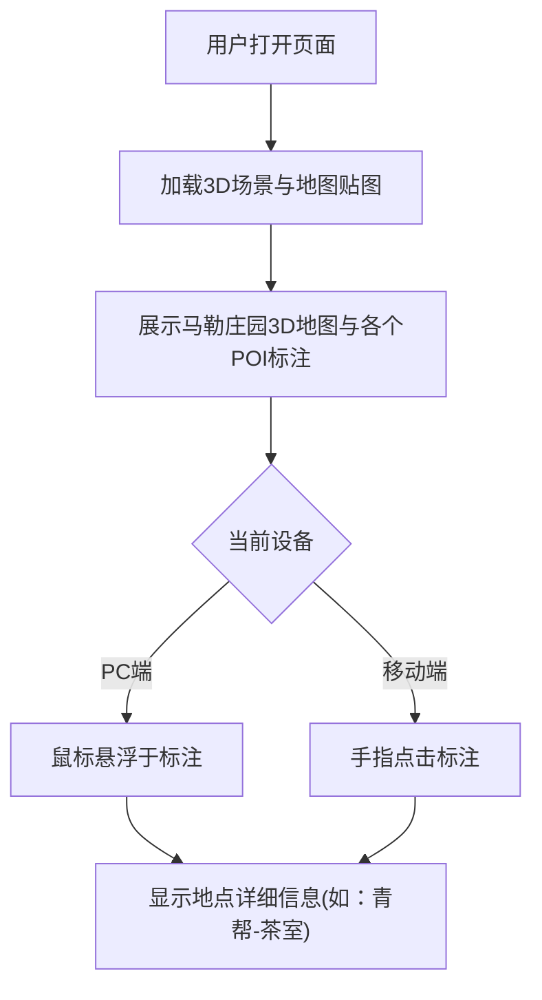

## 1. 产品概述
将《万平迷局》中的2D平面地图（马勒庄园版图）转化为一个具有3D视觉效果和交互功能的Web展示页面。
- 主要解决平面地图不够生动的问题，提供PC端悬浮和移动端点击的交互式地点查看体验。
- 目标受众为《万平迷局》的玩家或对马勒庄园地图感兴趣的用户，增强沉浸感。

## 2. 核心功能

### 2.1 功能模块
1. **3D地图主页**: 3D场景渲染，地图平面贴图，交互式兴趣点（POI）标注。
2. **地点详情悬浮窗**: 显示地点信息（青帮、商会、军医院、情报局及子地点）。

### 2.2 页面详细说明
| 页面名称 | 模块名称 | 功能描述 |
|-----------|-------------|---------------------|
| 3D地图主页 | 3D场景 | 渲染带有透视效果的地图底图，允许有限视角的平移和缩放 |
| 3D地图主页 | 兴趣点标注 | 根据给定的坐标或相对位置放置互动标记 |
| 3D地图主页 | 信息悬浮窗 | PC端鼠标悬浮、移动端点击时弹出该地点的详细信息 |

## 3. 核心流程
用户打开页面 -> 看到3D倾斜展示的马勒庄园地图 -> 寻找地点标注
-> (PC) 鼠标悬浮在标注上 -> 弹出详细信息
-> (Mobile) 手指点击标注 -> 弹出详细信息

## 4. 用户界面设计
### 4.1 设计风格
- 主色调：复古风格、与原图“马勒庄园”相符的民国/微悬疑氛围色调（如暗金、深绿、复古棕）。
- 按钮风格：带有微3D效果的半透明玻璃态（Glassmorphism）以保持现代感，或者复古纸张风。
- 字体：衬线字体为主，营造复古悬疑感。
- 布局风格：全屏3D画布，悬浮窗在标注点上方浮动。
- 动画效果：平滑的视角入场动画，悬浮时标注点的高亮和呼吸效果。

### 4.2 页面设计概览
| 页面名称 | 模块名称 | UI 元素 |
|-----------|-------------|-------------|
| 主页 | 3D 画布 | 全屏背景，微透视倾斜的地图图像 |
| 主页 | POI 标注 | 发光圆点或复古图钉样式 |
| 主页 | 信息浮层 | 磨砂玻璃质感背景，包含地点名称及子建筑列表 |

### 4.3 响应式
桌面优先设计，完美适配移动设备。移动端屏蔽悬浮事件，改用点击事件触发信息浮层。

### 4.4 3D场景指导
- 环境与氛围：略带复古噪点，边缘有暗角（Vignette）以增强代入感。
- 光照设置：环境光结合柔和的定向光，突出场景深度。
- 相机设置：透视相机（PerspectiveCamera），限制旋转角度防止看穿底面，提供适当的缩放限制。
- 合成与焦点：主图置于中央，通过OrbitControls提供有限度的旋转。
- 交互与动画：进入页面时的相机拉近过渡动画，标记点的上下浮动呼吸动画。
- 资源来源：使用用户提供的 `f:\New World\public\map.jpg` 作为主贴图。
