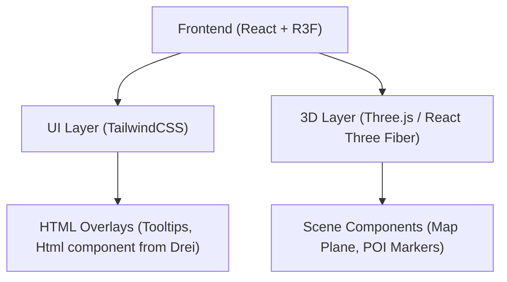

## 1. 架构设计


## 2. 技术说明
- 前端框架: React@18 + tailwindcss@3 + vite
- 初始化工具: vite-init (使用 react-ts 模板)
- 3D 渲染: three, @react-three/fiber, @react-three/drei
- 动画库: framer-motion (用于UI过渡及悬浮窗动画)
- 图标库: lucide-react

## 3. 路由定义
| 路由 | 目的 |
|-------|---------|
| / | 主页，承载唯一的3D地图画布和UI遮罩 |

## 4. 数据模型
本地配置数据，不涉及后端。在代码中定义为常量，用于驱动POI标记的渲染。
```typescript
interface SubLocation {
  name: string;
  icon?: string; // 对应 lucide-react 的图标名，或者描述
}

interface PointOfInterest {
  id: string;
  name: string;
  description?: string;
  position: [number, number, number]; // 3D坐标 [x, y, z]
  category: '青帮' | '商会' | '军医院' | '情报局';
  subLocations?: SubLocation[];
}
```
